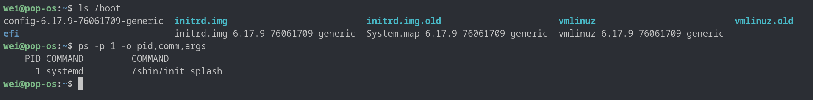

# 開機到系統運行：系統架構總覽

<div align="center">

[📖 中文](README.zh.md) | [📖 English](README.md)

</div>

## 0. 開始前：從 Windows 轉移到 Linux

詳見：[從 Windows 轉移到 Linux](./migrating-windows-to-linux.zh.md)

## 1. 從開機到運行
```
1. 按下電源
   ↓
2. BIOS/UEFI 初始化硬體
   - 檢測 CPU、記憶體、硬碟
   ↓
3. BIOS/UEFI 載入 Bootloader (GRUB) 到記憶體
   - 從硬碟的特定位置讀取
   ↓
4. GRUB 顯示選單 ← 你在這選擇 OS/Kernel
   ↓
5. GRUB 載入 Kernel 到記憶體
   - 從 /boot/vmlinuz 讀取
   - 同時載入 initramfs (臨時檔案系統)
   ↓
6. Kernel 開始執行 (在記憶體中)
   - 初始化硬體
   - 設定記憶體管理
   - 掛載根檔案系統
   ↓
7. Kernel 啟動第一個程序：init (PID 1)
   - 現代 Linux 這是 systemd
   ↓
8. systemd 啟動 User Space
   - 啟動各種服務
   - 準備登入環境
   ↓
9. 系統就緒！
```

### 驗證流程

```shell
ls /boot
```

```shell
ps -p 1 -o pid,comm,args
```



透過 指令 與 結果 可以驗證
1. /boot 目錄下有 vmlinuz 檔案
2. pid 1 是 systemd 程式

### 流程思考 Q and A
#### Q: 什麼是 Bootloader (GRUB) ?
> A: Bootloader 是負責在開機時載入 Kernel 的程式

#### Q: 開機隨身碟會有哪些內容呢有哪些內容呢 ?
> A: 開機隨身碟會包含 除了事先下載的 ISO 檔案外 還會包含 Bootloader (GRUB) 和 Linux Kernel 等

#### Q: Linux Kernel 會持續運行嗎 ?
> A: 是的, Linux Kernel 會持續運行 直到系統關機 並且壓縮在 memory 中 而不是在硬碟中

## 2. System Architecture Overview
```
┌─────────────────────────────────────┐
│        User Applications            │ 使用者程式
│    (browser, editor, game, etc.)    │
├─────────────────────────────────────┤
│         System Libraries            │ 系統函式庫
│       (libc, libpthread...)         │ (glibc 等)
├─────────────────────────────────────┤
│         System Call Interface       │ 系統呼叫介面
│      (read, write, fork, exec...)   │
╞═════════════════════════════════════╡ ← User/Kernel 分界線
│          Linux Kernel               │
│  ┌─────────────────────────────┐    │
│  │   Process Management        │    │ 行程管理
│  │   Memory Management         │    │ 記憶體管理
│  │   File System               │    │ 檔案系統
│  │   Device Drivers            │    │ 驅動程式
│  │   Network Stack             │    │ 網路堆疊
│  └─────────────────────────────┘    │
├─────────────────────────────────────┤
│         Hardware                    │ 硬體
│   (CPU, RAM, Disk, Network...)      │
└─────────────────────────────────────┘
```

必須說 在學生時期確實完全不動相對應該念(待在 windows 溫室裡太久 哈哈哈 完全不懂細節)

首先 User Applications 就是我們平常使用的程式 例如：瀏覽器、編輯器、遊戲等
1. 也是做區隔開來 與 Kernel 分開 避免 Kernel 被破壞
2. 可以有不同的 User Applications 例如：root 和 user 可以有不同的瀏覽器、編輯器、遊戲等
3. 可以試看看 使用 `whoami` 命令 看看你現在是什麼用戶

System Libraries 就是系統函式庫 例如：libc, libpthread... (glibc 等)
1. 也是做區隔開來 與 Kernel 分開 避免 Kernel 被破壞
2. 可以有不同的 System Libraries 例如：root 和 user 可以有不同的 libc, libpthread... (glibc 等)
3. 可以試看看 使用 `ldd` 命令 看看你現在的程式使用了哪些系統函式庫

System Call Interface 就是系統呼叫介面 例如：read, write, fork, exec...
1. 也是做區隔開來 與 Kernel 分開 避免 Kernel 被破壞
2. 可以有不同的 System Call Interface 例如：root 和 user 可以有不同的 read, write, fork, exec...
3. 可以試看看 使用 `man 2 read` 命令 看看你現在的程式使用了哪些系統呼叫介面

```
備註:
  在 軟體 開發中, Interface 概念 很常用到 很湊巧 其實是相同的設計想法
  不要讓高層的應用去碰到實現 只要且只能呼叫已經定義好的方法就好

  在 OS 的設計中, 也是如此
  Application 只能呼叫 System Call Interface, 不能直接呼叫 Kernel 的函數
  這樣可以保證 Kernel 的穩定性 和 安全性
```

## 3. 相關驗證實驗
透過 rust 程式 來驗證 上述的理論


- 高階語言（例如 Rust C）程式會經過下列步驟才能在作業系統上執行：
  1. **程式編譯**
     - 原始碼經由編譯器（例如 rustc gcc）編譯為組合語言，再由組譯器（assembler）轉換為機器碼（machine code）。
     - 產生的執行檔通常為 ELF 格式（Linux 常見可執行檔格式）。
  2. **程式載入**
     - 使用者執行程式時（例如執行 `./my_program`），作業系統透過 `exec` 系統呼叫將機器碼從硬碟載入到記憶體（RAM）。
  3. **CPU 執行**
     - CPU 會從記憶體中抓取指令並執行，只能直接理解和執行機器碼。
     - 程式包含的純計算指令由 CPU 直接執行；若程式需存取作業系統資源（如檔案、網路），則會透過系統函式庫（如 glibc）發出 system call（系統呼叫）。
  4. **系統呼叫（System Call）與核心 ( System Kernel ) 交互**
     - 系統函式庫在需要時，會轉而呼叫對應的 system call 與 Linux 核心互動，讓核心代為處理如檔案存取、IO、網路等底層操作。
     - 核心負責排程（將工作分配給 CPU）、資源控管，以及安全性隔離等。
- 總結：高階語言程式經過編譯、由作業系統載入至記憶體後，CPU 執行機器碼，遇到需要作業系統支援的操作時會透過 system call 進入核心，由核心負責與硬體及底層資源互動。

整體運行流程如下：
```
┌──────────────────────────────────────────────────────┐
│  Stage 1: Compilation (Development Time)             │
│                                                      │
│  Rust source code                                    │
│       ↓ [rustc compiler]                             │
│  Assembly code                                       │
│       ↓ [assembler]                                  │
│  Machine code                                        │
│       ↓                                              │
│  Executable file stored on disk (ELF binary)         │
└──────────────────────────────────────────────────────┘

┌──────────────────────────────────────────────────────┐
│  Stage 2: Loading (When Running the Program)         │
│                                                      │
│  User runs the program (e.g., ./my_program)          │
│       ↓                                              │
│  Kernel reads the machine code from disk             │
│       ↓ [exec system call]                           │
│  Loads into RAM (memory)                             │
│       ↓                                              │
│  CPU begins fetching instructions from RAM           │
└──────────────────────────────────────────────────────┘

┌──────────────────────────────────────────────────────┐
│  Stage 3: Execution (Runtime)                        │
│                                                      │
│  ┌─────────────────────────────────────────┐         │
│  │  User Space (Your Program)              │         │
│  │                                         │         │
│  │  CPU executes machine code:             │         │
│  │  • Pure computation → executes directly │         │
│  │  • Needs hardware → calls system library│         │
│  │                      ↓                  │         │
│  │                 System Call             │         │
│  └─────────────────────┬───────────────────┘         │
│                        │                             │
│  ═════════════════════════════════════════════       │
│                        ↓                             │
│  ┌─────────────────────────────────────────┐         │
│  │  Kernel Space (the Kernel)              │         │
│  │                                         │         │
│  │  • Handles the system call              │         │
│  │  • Operates hardware (files/net/mem...) │         │
│  │  • Returns result                       │         │
│  └─────────────────────┬───────────────────┘         │
│                        │                             │
│                        ↓                             │
│  Program continues with the next instruction         │ 
└──────────────────────────────────────────────────────┘
```

詳見：[實驗](./experiment.zh.md)